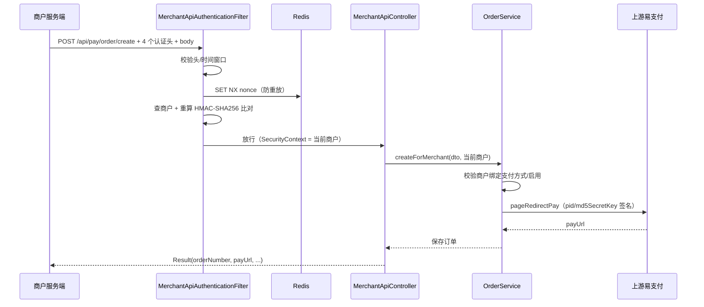

# 支付模块商户 API 接入设计方案

> 状态：设计稿（待评审，暂不实现）
> 日期：2026-08-24
> 关联待办：`Todo.md` 第 1 条「商户接入大部分为 API 方式创建查询订单，是否需要引入第二种认证方式」

---

## 1. 背景

当前 `admin-pay` 模块的订单能力是面向**管理后台**的：

- 后台用户登录后拿到 JWT（`admin-auth` 模块），携带 `Authorization` 头访问 `/pay/order/**` 等接口；
- `OrderService.create` 是管理员视角：管理员选择应用/支付方式，系统自动通过 `selectBestMerchantByMethodId` 挑选商户向上游下单。

后续商户接入以 **API 方式**为主（商户服务端直连我方创建/查询订单），与现有「登录 token + 菜单权限」的模式存在本质差异，需要引入**第二种认证方式**。

---

## 2. 现状梳理（代码级）

| 关注点 | 现状 | 位置 |
|---|---|---|
| 后台认证 | JWT + Redis，主体是内部用户 `User` | `admin-auth/security/JwtAuthenticationFilter`、`service/TokenService` |
| 安全配置 | 所有请求 `authenticated()`；`@Anonymous` 扫描放行 | `admin-auth/security/SpringSecurityConfig` |
| 权限模型 | 菜单权限字符串（`pay:order:read` 等），通过 `@PermissionPrefix` + CRUD 注解 | `admin-crud/controller/CrudController` |
| 商户模型 | `Merchant` 已有 `merchantId`、`md5SecretKey`（仅用于对上游易支付签名） | `admin-pay/domain/entity/Merchant` |
| 订单创建 | 管理员视角，自动选商户 | `admin-pay/service/OrderService.create` |
| 订单查询 | 后台分页查询，无商户维度隔离 | `OrderQueryCondition`（已注释 `merchantId` 条件） |
| 回调 | `@Anonymous` 的 `/pay/order/notify`，验上游签名 | `OrderService.isNotifyParamValid` |
| 依赖 | `admin-pay` 已依赖 `commons-codec`（可直接用 `HmacUtils`） | `admin-pay/pom.xml` |

结论：**不能**把商户塞进现有 JWT/User 体系（身份主体、权限模型、Redis token key、`AuthContext` 全都要兼容两套逻辑），应新增一条独立的商户 API 认证链。

---

## 3. 方案选型

| 方案 | 说明 | 结论 |
|---|---|---|
| A. AppId + Secret + 每次请求签名 | 商户每次请求携带 `appId/timestamp/nonce/sign`，服务端验签 + 防重放 | ✅ **推荐**（支付宝/微信/易支付均为该模式，无状态、防篡改防重放） |
| B. AppId + Secret 换发商户 JWT | 首次签名换取 token，后续只带 token | 首次仍需签名，多一套 token 生命周期管理，复杂度高 |
| C. OAuth2 Client Credentials | 标准协议 | 对当前体量过重，需引入授权服务器，不划算 |

签名算法选择：**HMAC-SHA256**（推荐，`commons-codec` 已具备）。若为了与上游易支付 MD5 模式保持一致而降低商户对接成本，可退化为 MD5，但不推荐（MD5 已不适用于签名场景）。

---

## 4. 总体设计

```
商户服务端
    │  POST /api/pay/order/create  /  POST /api/pay/order/query
    │  Headers: X-App-Id, X-Timestamp, X-Nonce, X-Sign
    ▼
MerchantApiAuthenticationFilter（仅拦截 /api/pay/**）
    │  1. 校验头完整性
    │  2. 校验时间戳窗口（±300s）
    │  3. 校验 nonce 未使用（Redis SET NX，防重放）
    │  4. 按 appId 查商户 → 商户/平台启用校验
    │  5. 重算 HMAC-SHA256 签名并常量时间比对
    │  6. 认证通过：MerchantApiAuthenticationToken 写入 SecurityContext
    ▼
MerchantApiController → OrderService.createForMerchant / queryForMerchant
    │  强制以「当前商户」身份创建/查询，数据隔离
    ▼
Result<T> 统一响应
```

与现有后台认证的关系：

- 后台接口（`/pay/order/**` 等）保持 **JWT 认证不变**；
- 商户接口（`/api/pay/**`）走**独立过滤链**，两者互不干扰；
- 上游回调 `/pay/order/notify` 保持 `@Anonymous` 不变（验上游签名，非商户签名）。

---

## 5. 详细设计

### 5.1 商户模型变更

`Merchant` 实体新增两个字段（与上游 `md5SecretKey` 分离）：

| 字段 | 类型 | 说明 |
|---|---|---|
| `appId` | String(32) | 商户 API 身份标识，唯一，对外公开 |
| `apiSecret` | String(64) | 商户 API 签名密钥（HMAC-SHA256），仅存密文/脱敏展示，不通过接口明文返回 |

```sql
ALTER TABLE pay_merchant
    ADD COLUMN app_id      VARCHAR(32) NOT NULL COMMENT '商户API身份标识(appId)' AFTER merchant_id,
    ADD COLUMN api_secret  VARCHAR(64) NOT NULL COMMENT '商户API签名密钥(HMAC-SHA256)' AFTER md5_secret_key,
    ADD UNIQUE KEY uk_pay_merchant_app_id (app_id);
```

存量数据初始化：`app_id` 生成随机串（如 `M` + 时间戳 + 随机数），`api_secret` 生成 32 字节随机数的 hex；后台商户管理界面提供「重置密钥」操作。

> 为什么与 `md5SecretKey` 分开：`md5SecretKey` 是**我们作为商户**去上游易支付下单时用的密钥；`apiSecret` 是**商户调我们**时用的密钥。角色相反，若共用会产生密钥泄露交叉风险。

### 5.2 认证头与签名算法

商户请求需携带 4 个请求头：

| Header | 必填 | 说明 |
|---|---|---|
| `X-App-Id` | 是 | 商户 appId |
| `X-Timestamp` | 是 | 毫秒时间戳，服务端校验 ±300s（可配置） |
| `X-Nonce` | 是 | 随机串（UUID），防重放 |
| `X-Sign` | 是 | HMAC-SHA256 签名，hex 小写 |

**待签字符串**（`\n` 分隔，覆盖 body 防止篡改金额等参数）：

```
String canonical = String.join("\n",
        appId,
        timestamp,
        nonce,
        request.getMethod(),       // 大写，如 POST
        request.getRequestURI(),   // 如 /api/pay/order/create
        rawBody                    // 原始请求体字符串（JSON）
);

String sign = HmacUtils.hmacSha256Hex(apiSecret, canonical);
```

说明：

- 对**原始 body 字节**签名，不要求 JSON 字段排序，商户实现最简单；服务端通过 `ContentCachingRequestWrapper` 缓存 body 供过滤器读取和后续 Controller 消费；
- 若未来需要支持 GET 参数查询，可扩展为「按 key 字典序排序参数 + secret」的拼接方式（与易支付 `TreeMap` 签名逻辑类似，见 `OrderService.parseReturnParam`）。

### 5.3 认证过滤器

新增 `MerchantApiAuthenticationFilter extends OncePerRequestFilter`，仅处理 `/api/pay/**`：

```java
// 伪代码（实现时细化）
protected void doFilterInternal(req, res, chain) {
    if (!path.startsWith("/api/pay/")) { chain.doFilter(req, res); return; }

    String appId     = req.getHeader("X-App-Id");
    String timestamp = req.getHeader("X-Timestamp");
    String nonce     = req.getHeader("X-Nonce");
    String sign      = req.getHeader("X-Sign");

    // 1. 头完整性（缺失 → 401 MERCHANT_API_HEADER_MISSING）
    // 2. 时间窗口：|now - timestamp| <= 300_000（否则 → 401 TIMESTAMP_INVALID）
    // 3. 防重放：redisTemplate.opsForValue().setIfAbsent(
    //        "merchant:api:nonce:" + appId + ":" + nonce, "1", 5, MINUTES)
    //    （失败 → 401 NONCE_REPLAYED）
    // 4. 查商户：merchantRepository.findByAppId(appId)
    //    （不存在 → 401 MERCHANT_NOT_EXISTED；未启用或平台未启用 → 401 MERCHANT_DISABLED）
    // 5. 缓存 body 后重算签名：MessageDigest.isEqual(computed, sign)
    //    （不等 → 401 SIGN_INVALID）
    // 6. SecurityContextHolder.getContext().setAuthentication(
    //        new MerchantApiAuthenticationToken(merchant));
    chain.doFilter(wrappedRequest, res);
}
```

认证失败直接写 JSON（沿用 `JwtAuthenticationFilter.writeErrorResponse` 风格）：

```json
{ "success": false, "reason": "SIGN_INVALID", "message": "签名校验失败" }
```

HTTP 状态码建议 `401`（与现有 JWT 过滤器一致）。

### 5.4 与 Spring Security 集成（两条过滤链）

推荐改造 `SpringSecurityConfig`（或新增 pay 侧配置），拆成两条 `SecurityFilterChain`：

```java
@Bean
@Order(1)
SecurityFilterChain merchantApiFilterChain(HttpSecurity http) {
    http.securityMatcher("/api/pay/**")
        .csrf(AbstractHttpConfigurer::disable)
        .cors(Customizer.withDefaults())
        .authorizeHttpRequests(a -> a.anyRequest().authenticated())
        .addFilterBefore(merchantApiAuthenticationFilter, UsernamePasswordAuthenticationFilter.class);
    return http.build();
}

@Bean
@Order(2)
SecurityFilterChain adminFilterChain(HttpSecurity http) {
    http.securityMatcher("/**")   // 或保持现有 anyRequest 链
        .csrf(AbstractHttpConfigurer::disable)
        .cors(Customizer.withDefaults())
        .authorizeHttpRequests(a -> a.anyRequest().authenticated())
        .addFilterBefore(jwtAuthenticationFilter, UsernamePasswordAuthenticationFilter.class);
    return http.build();
}
```

要点：

- 两条链通过 `securityMatcher` 划分路径，`/api/pay/**` 不会进入 JWT 链，现有后台行为完全不变；
- `@Anonymous` 扫描逻辑（`webSecurityCustomizer`）继续作用于后台链，商户链不参与；
- `MerchantApiAuthenticationFilter` 作为 bean 会被 Spring Boot 自动注册到 Servlet 容器，需像 `JwtAuthenticationFilter` 一样 `FilterRegistrationBean.setEnabled(false)` 防止执行两次。

### 5.5 商户上下文

仿照 `AuthContext` 新增 `MerchantContext`：

```java
@Component
public class MerchantContext {
    public Merchant getCurrentMerchant() {
        Authentication auth = SecurityContextHolder.getContext().getAuthentication();
        if (auth instanceof MerchantApiAuthenticationToken token) {
            return (Merchant) token.getPrincipal();
        }
        throw new BusinessException(PayError.MERCHANT_NOT_AUTHENTICATED);
    }
}
```

`MerchantApiAuthenticationToken`：`principal = Merchant`，`authorities = List.of(new SimpleGrantedAuthority("MERCHANT_API"))`。

### 5.6 商户 API 接口设计

#### 5.6.1 创建订单

`POST /api/pay/order/create`

请求体：

```json
{
  "productName": "一元包天套餐",
  "productPrice": "1.00",
  "productQuantity": 1,
  "methodCode": "alipay",
  "notifyUrl": "https://merchant.example.com/pay/notify",
  "returnUrl": "https://merchant.example.com/pay/return",
  "merchantOrderNumber": "M202608240001",
  "remark": "备注"
}
```

| 字段 | 必填 | 说明 |
|---|---|---|
| productName | 是 | 商品名称 |
| productPrice | 是 | 商品单价（BigDecimal） |
| productQuantity | 是 | 数量，≥1 |
| methodCode | 是 | 支付方式编码（`Method.value`，如 alipay/wxpay），比 methodId 更稳定 |
| notifyUrl | 是 | 商户回调地址（**由商户传入**，不再用全局 `epay.notifyUrl`） |
| returnUrl | 否 | 支付完成跳转地址，缺省等同 notifyUrl |
| merchantOrderNumber | 否 | 商户订单号；不传则平台生成 `orderNumber`；传了则需保证商户内唯一 |
| remark | 否 | 备注 |

响应：

```json
{
  "success": true,
  "data": {
    "orderNumber": "20260824120000000001",
    "merchantOrderNumber": "M202608240001",
    "payUrl": "https://66.hm659.org/submit.php?...",
    "totalAmount": "1.00",
    "payStatus": "UNPAID"
  }
}
```

服务端逻辑（`OrderService.createForMerchant`）：

1. 从 `MerchantContext` 取当前商户；
2. 按 `methodCode` 查 `Method`，校验存在、启用；
3. 校验当前商户已绑定该 method（`merchant.getMethodList()` 包含）且商户、平台均启用；
4. 组装订单：`merchant = 当前商户`（**不再走 `selectBestMerchantByMethodId`**）；
5. `notifyUrl/returnUrl` 使用商户传入值；
6. 生成 `orderNumber`（沿用现有 Redis 序列）、生成 `payUrl`（复用 `buildEPayApi` + `buildRedirectPayParam`）；
7. 保存并返回 VO。

#### 5.6.2 查询订单

`POST /api/pay/order/query`

请求体：

```json
{
  "orderNumber": "20260824120000000001"
}
```

或：

```json
{
  "merchantOrderNumber": "M202608240001"
}
```

响应：

```json
{
  "success": true,
  "data": {
    "orderNumber": "20260824120000000001",
    "merchantOrderNumber": "M202608240001",
    "productName": "一元包天套餐",
    "totalAmount": "1.00",
    "payStatus": "PAID",
    "payUrl": "https://...",
    "payDate": "2026-08-24 12:05:00"
  }
}
```

服务端逻辑（`OrderService.queryForMerchant`）：

- 强制过滤 `merchant = 当前商户`，使用 `orderRepository.findByOrderNumberAndMerchantId(...)`；
- 查不到或不属于当前商户，统一返回「订单不存在」（避免暴露他人订单号是否存在，可复用 `PayError.ORDER_NOT_EXISTED`）。

### 5.7 数据隔离

- 商户创建/查询订单一律以 `MerchantContext` 中的商户为准，**不接受请求参数指定 merchantId**；
- `OrderRepository` 新增：

```java
Optional<Order> findByOrderNumberAndMerchantId(String orderNumber, Long merchantId);
Optional<Order> findByMerchantOrderNumberAndMerchantId(String merchantOrderNumber, Long merchantId);
```

- `Order` 实体可选新增 `merchantOrderNumber` 字段（`pay_order` 表加列 + `merchant_id` 组合唯一索引）。

### 5.8 错误码扩展

`PayError` 枚举新增：

| reason | message |
|---|---|
| MERCHANT_API_HEADER_MISSING | 缺少认证头（X-App-Id / X-Timestamp / X-Nonce / X-Sign） |
| TIMESTAMP_INVALID | 时间戳超出有效窗口 |
| NONCE_REPLAYED | 重复请求（nonce 已使用） |
| MERCHANT_NOT_EXISTED | 商户不存在 |
| MERCHANT_DISABLED | 商户已禁用 |
| SIGN_INVALID | 签名校验失败 |
| MERCHANT_NOT_AUTHENTICATED | 当前请求未通过商户认证 |
| METHOD_NOT_BOUND_TO_MERCHANT | 商户未开通该支付方式 |
| METHOD_DISABLED | 支付方式已禁用 |
| MERCHANT_ORDER_NUMBER_DUPLICATED | 商户订单号重复 |

> 过滤器内发生的错误走过滤器直接写 JSON（无法被 `@RestControllerAdvice` 捕获），业务错误（如商户未开通支付方式）正常抛 `BusinessException` 由 `GlobalExceptionHandler` 处理。

---

## 6. 时序图



---

## 7. 文件清单（实施时新增/修改）

```
admin-pay/src/main/java/com/example/pay/
├── controller/api/
│   └── MerchantApiController.java            # 新增：/api/pay/order/create、/query
├── context/
│   └── MerchantContext.java                  # 新增：获取当前商户
├── domain/dto/
│   ├── MerchantApiOrderCreateDto.java        # 新增
│   └── MerchantApiOrderQueryDto.java         # 新增
├── domain/vo/
│   └── MerchantApiOrderVo.java               # 新增
├── domain/entity/
│   └── Merchant.java                         # 修改：+appId +apiSecret
│   └── Order.java                            # 修改：+merchantOrderNumber（可选）
├── domain/enums/
│   └── PayError.java                         # 修改：+错误码
├── repository/
│   ├── MerchantRepository.java               # 修改：+findByAppId
│   └── OrderRepository.java                  # 修改：+按商户查询方法
├── security/
│   ├── MerchantApiAuthenticationFilter.java  # 新增：商户签名认证过滤器
│   ├── MerchantApiAuthenticationToken.java   # 新增：认证主体
│   └── MerchantApiSecurityConfig.java        # 新增：/api/pay/** 过滤链（@Order(1)）
├── service/
│   ├── MerchantApiAuthService.java           # 新增：验签逻辑（可并入 Filter）
│   └── OrderService.java                     # 修改：+createForMerchant +queryForMerchant
└── util/
    └── MerchantSignUtil.java                 # 新增：HMAC-SHA256 签名工具

admin-auth/src/main/java/com/example/auth/security/
└── SpringSecurityConfig.java                 # 修改：拆两条过滤链（或仅调整匹配规则）

sql/
└── pay_merchant_api.sql                      # 新增：增量 DDL + 存量数据初始化
```

---

## 8. 安全注意事项

1. **HTTPS 强制**：签名头 + body 明文传输在 HTTP 下可被截获重放，生产必须 HTTPS。
2. **密钥分离**：商户 API 密钥 `apiSecret` 与上游 `md5SecretKey` 分离；`apiSecret` 不允许通过任何接口明文返回，后台展示脱敏，仅支持重置。
3. **防重放**：nonce + 时间窗口双保险；Redis key 带 TTL（与时间窗口一致），避免无限膨胀。
4. **常量时间比较**：签名比对用 `MessageDigest.isEqual`，避免时序侧信道。
5. **金额精度**：金额用 `BigDecimal`，签名覆盖原始 body，防止金额、订单号被篡改。
6. **数据隔离兜底**：即使未来出现越权，查询/创建均以认证后的商户为准，不信任请求参数中的商户标识。
7. **回调校验**：`/pay/order/notify` 继续验上游签名，且按 `out_trade_no` 落库；后续「完善订单回调处理」（Todo 第 2 条）应补充：回调内容与订单金额比对、回调结果通知商户（按订单上记录的商户 notifyUrl 二次通知）。

---

## 9. 实施步骤（建议拆解）

1. SQL 变更 + `Merchant` 实体字段 + 后台商户管理支持生成/重置 `appId/apiSecret`；
2. `MerchantSignUtil` + 单元测试（含跨语言样例，方便商户对接）；
3. `PayError` 扩展 + `MerchantContext` + `MerchantApiAuthenticationToken`；
4. `MerchantApiAuthenticationFilter` + 过滤链拆分，回归验证后台登录接口不受影响；
5. `OrderService.createForMerchant / queryForMerchant` + `MerchantApiController`；
6. 商户联调样例（Java/Python/Node 签名示例 + curl 示例）；
7. 生产安全项检查（HTTPS、密钥管理、防重放 TTL、日志脱敏）。

---

## 10. 开放问题

- [ ] 是否支持商户自定义 `merchantOrderNumber`？建议支持（商户对账常用），需加唯一约束与防重逻辑；
- [ ] `methodCode` 用 `Method.value`（alipay/wxpay）是否足够，还是需要引入新的商户端支付方式编码？
- [ ] 是否在商户 API 中加入「按时间范围查询订单列表」？首期只做单笔查询，后续按需扩展；
- [ ] 商户 API 是否独立部署（独立域名/网关）？如独立，需同步调整 CORS 与防火墙策略；
- [ ] `apiSecret` 是否需要加密存储（如 AES/BCrypt）？当前系统密钥均为明文存储，安全评审时一并确认。
